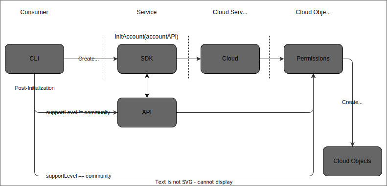

# Summary

The following is a guide for getting started with the Klearwave application platform.


## Initialize the Cloud Account

The first step in getting started with Klearwave is to initialize your cloud account.  Klearwave
creates specific permissions in the account and utilizes those permissions to perform 
followon operations.  These operations include such things as provisioning platforms.

The following describes the flow for account initialization:



1. For the initial step, we expect you to configure authentication to your specific cloud.  We will 
use your initial credentials to create additional permissions that we use in followon operations.

    * [AWS](https://docs.aws.amazon.com/cli/latest/userguide/getting-started-quickstart.html)


1. Klearwave is designed to respect an individual organization's desire to use modern 
infrastructure-as-code practices.  Thus, the first step to account initialization is to generate 
a configuration that includes all inputs required for account initialization.  This configuration 
may be forked, modified and re-used as each new cloud account needs to be initialized.

    ```bash
    klearwave init platform account config --type=aws --output=/tmp/aws.yaml
    ```


1. The above command will output a file that contains all inputs for account initialization and 
looks like the below:

    ```yaml
    apiVersion: infrastructure.klearwave.io/v0
    kind: AWSAccount
    metadata:
      name: aws
    spec:
      supportLevel: community
      allowedRoles: []
    ```

1. Once a configuration has been created and modified to the user liking, the configuration can then
be used to initialize the AWS account.  It is important to note that the local user authentication 
for the specific cloud account is used and should be configured prior to running the next command.

    ```bash
    klearwave init platform account --config=/tmp/aws.yaml
    ```
